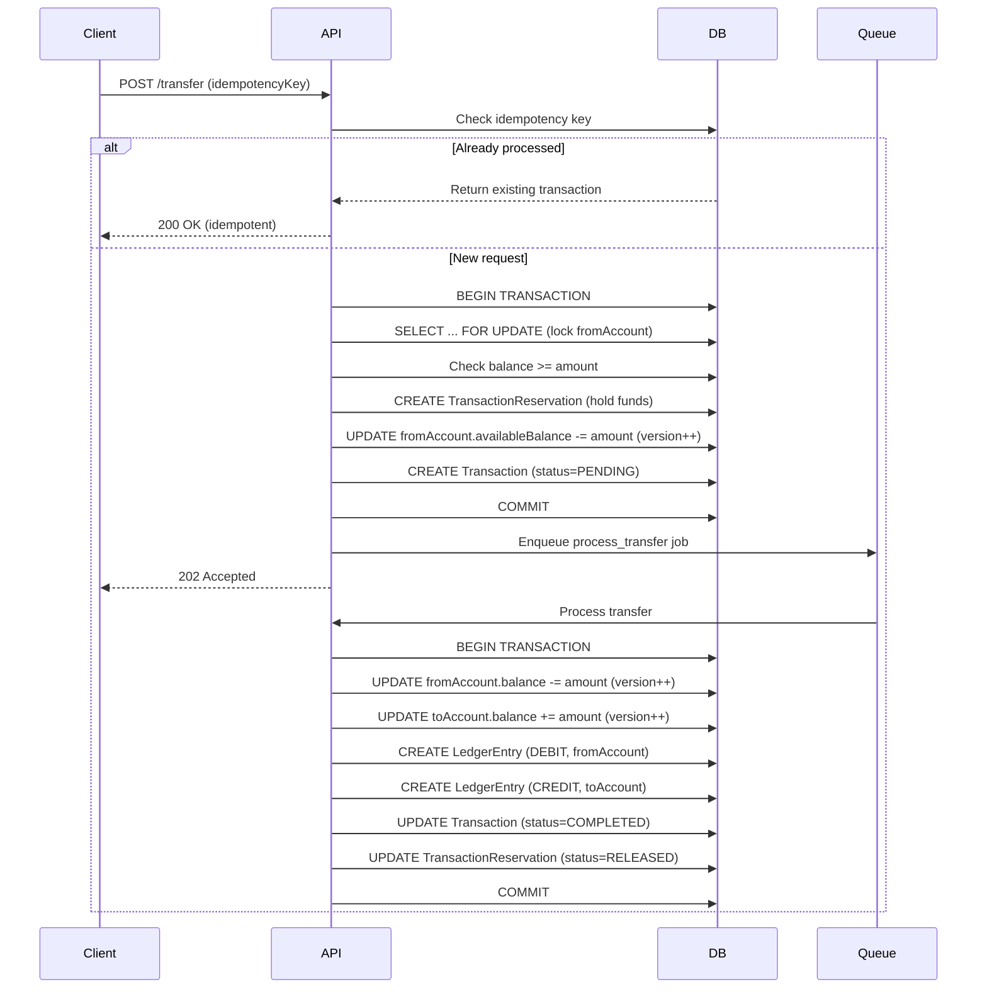
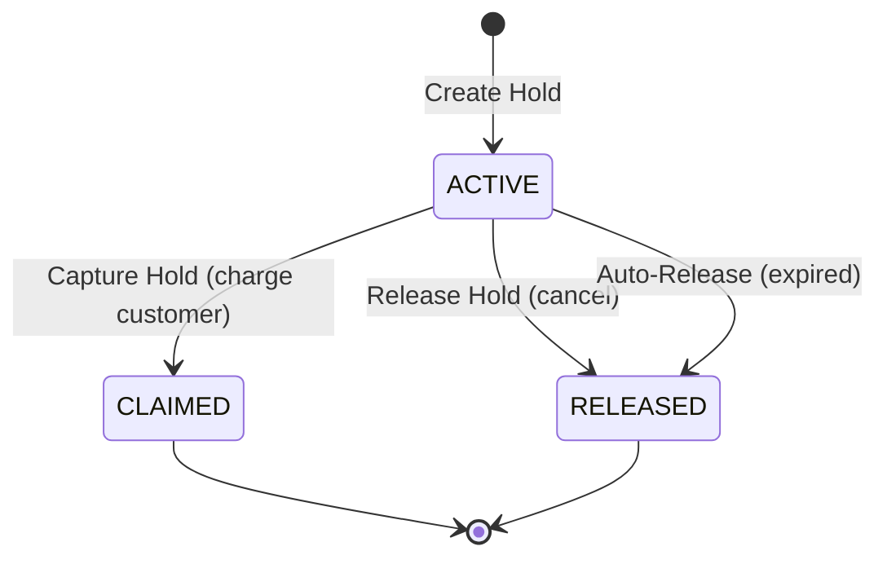
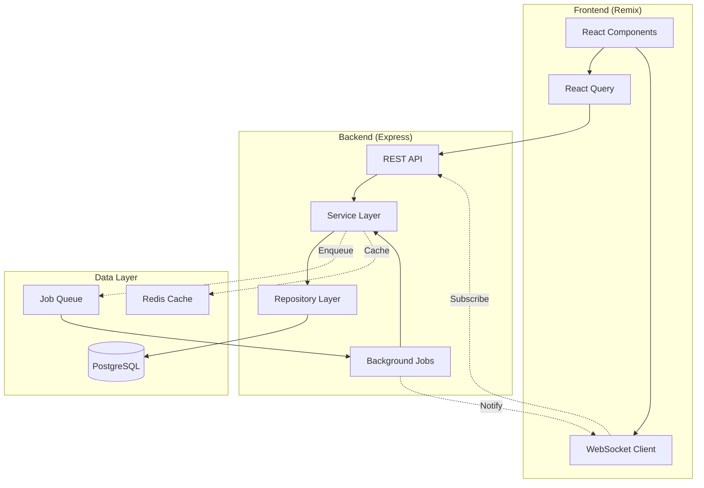

# Recommended Modules for Full-Stack Fintech Development

This document outlines **2 comprehensive modules** that demonstrate end-to-end fintech application development, including backend APIs, frontend integration, system design, and testing strategies.

## Overview

Both modules are selected based on the following criteria:

- ✅ **Solve critical fintech problems** (race conditions, idempotency, data integrity)
- ✅ **Demonstrate full-stack capabilities** (BE + FE + Testing)
- ✅ **Show system design expertise** (locking mechanisms, distributed systems)
- ✅ **Provide visual, interactive web experiences**

---

## Module 1: Transfer & Transaction Management 💸

### Summary

This module handles peer-to-peer (P2P) money transfers, transaction processing, and financial statement generation. It addresses critical fintech challenges including race conditions, double-spending prevention, and audit trail maintenance.

### Database Models

- **Transaction**: Core transaction records with idempotency support
- **TransactionReservation**: Two-phase commit for fund holds
- **LedgerEntry**: Double-entry bookkeeping for audit trails
- **Account**: Source and destination accounts with optimistic locking

### Major APIs

#### 1. Create P2P Transfer

**Endpoint**: `POST /api/transactions/transfer`

**Request Body**:

```json
{
  "idempotencyKey": "uuid-v4",
  "fromAccountId": "uuid",
  "toAccountId": "uuid",
  "amount": 100.0,
  "currency": "USD",
  "description": "Payment for services"
}
```

**Problem to Solve: Race Conditions & Concurrent Transactions**

> [!IMPORTANT]
> **The Challenge**: Multiple simultaneous transfers from the same account can cause:
>
> - **Overdraft**: Spending more than available balance
> - **Double-spending**: Same funds transferred multiple times
> - **Inconsistent state**: Balance mismatch between Account and LedgerEntry
> - **Lost updates**: Concurrent writes overwriting each other

**System Design Solutions**:

| Solution                  | Implementation                                           | Purpose                                     |
| ------------------------- | -------------------------------------------------------- | ------------------------------------------- |
| **Pessimistic Locking**   | `SELECT FOR UPDATE` on sender account only               | Prevent overdraft at source                 |
| **Optimistic Locking**    | `version` field for receiver account                     | Handle concurrent deposits safely           |
| **Two-Phase Commit**      | TransactionReservation with PENDING → ACTIVE → COMPLETED | Hold funds before final commit              |
| **Idempotency**           | Unique `idempotencyKey` per transaction                  | Prevent duplicate processing on retry       |
| **Double-Entry Ledger**   | LedgerEntry (DEBIT + CREDIT)                             | Immutable audit trail, balance verification |
| **Database Transactions** | Prisma `.$transaction()` with isolation level            | ACID guarantees across multiple operations  |

**Flow Diagram**:



**Response**:

```json
{
  "id": "uuid",
  "referenceNumber": "TXN20250126-001234",
  "status": "PENDING",
  "amount": 100.0,
  "currency": "USD",
  "createdAt": "2025-01-26T10:33:29Z"
}
```

---

#### 2. Get Transaction History with Statement

**Endpoint**: `GET /api/transactions/history?accountId={id}&limit=50&cursor={cursor}`

**Problem to Solve: Performance & Data Consistency**

> [!WARNING]
> **The Challenge**:
>
> - Query large datasets efficiently (millions of transactions)
> - Generate account statements with running balances
> - Ensure ledger entries sum to current account balance
> - Handle pagination without missing/duplicate records

**System Design Solutions**:

| Solution                    | Implementation                                  | Purpose                                  |
| --------------------------- | ----------------------------------------------- | ---------------------------------------- |
| **Cursor-based Pagination** | Use `createdAt` + `id` as cursor                | Consistent results even with new inserts |
| **Database Indexing**       | Composite index on `(accountId, createdAt, id)` | Fast query performance                   |
| **Balance Verification**    | Sum LedgerEntry amounts vs Account.balance      | Detect inconsistencies                   |
| **Query Optimization**      | Select only needed fields, use `include` wisely | Reduce data transfer                     |
| **Caching**                 | Cache recent transactions with Redis/LRU        | Reduce DB load for common queries        |

**Response**:

```json
{
  "data": [
    {
      "id": "uuid",
      "referenceNumber": "TXN20250126-001234",
      "type": "TRANSFER",
      "amount": -100.0,
      "currency": "USD",
      "balanceAfter": 900.0,
      "description": "Payment for services",
      "createdAt": "2025-01-26T10:33:29Z",
      "counterparty": {
        "accountNumber": "ACC123456",
        "name": "John Doe"
      }
    }
  ],
  "pagination": {
    "nextCursor": "2025-01-26T10:33:29Z|uuid",
    "hasMore": true
  },
  "summary": {
    "currentBalance": 900.0,
    "availableBalance": 850.0,
    "pendingTransactions": 1,
    "totalHolds": 50.0
  }
}
```

---

### Web Integration

#### Dashboard Components

1. **Balance Overview Card**
   - Display settled balance vs available balance
   - Visualize active holds with tooltip
   - Real-time updates via WebSocket

2. **Transfer Form**
   - Autocomplete recipient search
   - Amount validation against available balance
   - Confirmation dialog with summary
   - Optimistic UI updates

3. **Transaction Feed**
   - Infinite scroll with virtualization
   - Filter by type, date range, amount
   - Search by reference number or description
   - Export to PDF/CSV

4. **Statement View**
   - Monthly/quarterly statement generation
   - Running balance column
   - Downloadable PDF with branding

#### Tech Stack (Frontend)

- **Framework**: React 19 with Remix
- **UI Components**: Radix UI primitives + custom design system
- **State Management**: React Query for server state, Zustand for client state
- **Real-time**: WebSocket with automatic reconnection
- **Forms**: React Hook Form + Zod validation
- **Charts**: Recharts for balance timeline visualization

---

### Full Development Flow

#### Phase 1: Backend (BE)

1. **API Design** (1 day)
   - Define OpenAPI 3.1 specification
   - Document request/response schemas
   - Define error codes and messages

2. **Repository Pattern** (2 days)
   - Create `ITransactionRepository` interface
   - Implement with Prisma queries
   - Add optimistic locking with retry logic
   - Write unit tests for repository methods

3. **Service Layer** (3 days)
   - Implement `TransactionService` with business logic
   - Add two-phase commit flow
   - Implement idempotency checks
   - Create background job for async processing
   - Write unit tests with mocked repositories

4. **Controller & Routes** (1 day)
   - Implement HTTP handlers
   - Add Zod validation middleware
   - Map entities to DTOs
   - Add error handling middleware

5. **Background Jobs** (1 day)
   - Set up BullMQ or similar job queue
   - Implement transfer processing job
   - Add retry logic with exponential backoff
   - Monitor job failures

#### Phase 2: Frontend (FE)

1. **API Client** (1 day)
   - Generate TypeScript types from OpenAPI spec
   - Create API client with fetch wrapper
   - Add interceptors for auth/error handling

2. **Transfer Flow** (3 days)
   - Build transfer form with validation
   - Implement recipient search with debouncing
   - Add confirmation modal
   - Handle success/error states
   - Add optimistic updates

3. **Transaction List** (2 days)
   - Build infinite scroll component
   - Add filters and search
   - Implement virtual scrolling for performance
   - Add loading skeletons

4. **Real-time Updates** (2 days)
   - Set up WebSocket connection
   - Subscribe to account-specific events
   - Update UI on transaction status changes
   - Handle reconnection gracefully

#### Phase 3: Testing

1. **Unit Tests** (ongoing)
   - Test repository methods with in-memory DB
   - Test service logic with mocked dependencies
   - Test React components with React Testing Library
   - Achieve >80% code coverage

2. **Integration Tests** (2 days)
   - Test API endpoints with Supertest
   - Test database transactions with test DB
   - Test WebSocket events

3. **E2E Tests** (2 days)
   - Use Playwright for browser automation
   - Test complete transfer flow
   - Test error scenarios (insufficient funds, network errors)
   - Test concurrent transfers

4. **Load Testing** (1 day)
   - Use k6 or Artillery
   - Simulate 100+ concurrent transfers
   - Measure API latency (p50, p95, p99)
   - Identify bottlenecks

---

## Module 2: Account Management with Balance Holds 🏦

### Summary

This module handles account creation, balance management, and authorization holds (pre-authorizations). It demonstrates data integrity, business rule enforcement, and background job processing.

### Database Models

- **Account**: Core account entity with balance tracking
- **TransactionReservation**: Temporary holds on available balance
- **Customer**: Account owner with KYC status

### Major APIs

#### 1. Create Account with KYC Validation

**Endpoint**: `POST /api/accounts`

**Request Body**:

```json
{
  "customerId": "uuid",
  "currency": "USD",
  "initialDeposit": 100.0
}
```

**Problem to Solve: Data Integrity & Business Rules**

> [!IMPORTANT]
> **The Challenge**:
>
> - Ensure unique account numbers (prevent collisions)
> - Validate customer KYC status before account creation
> - Handle multi-currency accounts correctly
> - Set proper initial states and balances
> - Maintain referential integrity across modules

**System Design Solutions**:

| Solution                    | Implementation                                   | Purpose                                      |
| --------------------------- | ------------------------------------------------ | -------------------------------------------- |
| **Database Constraints**    | `@unique` on `accountNumber`                     | Enforce uniqueness at DB level               |
| **Custom Generator**        | IBAN-like algorithm with check digits            | Generate collision-resistant account numbers |
| **Cross-module Validation** | Check Customer.kycStatus before creation         | Enforce business rules                       |
| **Atomic Operations**       | Prisma transaction for account + initial deposit | All-or-nothing consistency                   |
| **Idempotency**             | Return existing account if duplicate request     | Handle network retries safely                |

**Account Number Generation Algorithm**:

```typescript
// Format: CCBBBBBBBBBBCCCC
// CC: Country code (2 digits)
// BBBBBBBBBB: Sequential base-36 number (10 chars)
// CCCC: Check digits using Luhn algorithm

function generateAccountNumber(countryCode: string = 'US'): string {
  const timestamp = Date.now();
  const random = Math.floor(Math.random() * 1000000);
  const base = (timestamp * 1000000 + random).toString(36).toUpperCase();
  const baseNumber = base.padStart(10, '0').slice(-10);
  const checkDigit = calculateLuhn(countryCode + baseNumber);

  return `${countryCode}${baseNumber}${checkDigit}`;
}
```

**Response**:

```json
{
  "id": "uuid",
  "accountNumber": "US1A2B3C4D561234",
  "currency": "USD",
  "balance": 100.0,
  "availableBalance": 100.0,
  "status": "ACTIVE",
  "createdAt": "2025-01-26T10:33:29Z"
}
```

---

#### 2. Manage Balance Holds/Reservations

**Endpoint**: `POST /api/accounts/{id}/holds`

**Request Body**:

```json
{
  "amount": 50.0,
  "expiresIn": 3600,
  "reason": "Hotel pre-authorization",
  "metadata": {
    "merchantId": "HOTEL123",
    "bookingId": "BOOK456"
  }
}
```

**Problem to Solve: Funds Availability & Authorization Holds**

> [!WARNING]
> **The Challenge**:
>
> - Hold funds for pending transactions (e.g., hotel pre-auth, gas station hold)
> - Auto-release expired holds without manual intervention
> - Calculate accurate `availableBalance = balance - sum(activeHolds)`
> - Prevent spending held funds
> - Handle hold capture (convert hold to actual charge)
> - Handle hold release (cancel hold)

**System Design Solutions**:

| Solution                | Implementation                              | Purpose                                  |
| ----------------------- | ------------------------------------------- | ---------------------------------------- |
| **Reservation Table**   | TransactionReservation with expiry          | Track all active holds separately        |
| **Background Job**      | Cron job every 5 minutes to release expired | Auto-cleanup without manual intervention |
| **Atomic Balance Calc** | Computed in SQL query or service layer      | Always consistent                        |
| **Composite Index**     | `(accountId, status)` on reservations       | Fast hold queries                        |
| **Status Machine**      | ACTIVE → RELEASED/CLAIMED                   | Clear state transitions                  |

**Hold Lifecycle**:



**Response**:

```json
{
  "id": "uuid",
  "accountId": "uuid",
  "amount": 50.0,
  "status": "ACTIVE",
  "expiresAt": "2025-01-26T11:33:29Z",
  "createdAt": "2025-01-26T10:33:29Z",
  "metadata": {
    "merchantId": "HOTEL123",
    "bookingId": "BOOK456"
  }
}
```

**Additional Endpoints**:

- `POST /api/accounts/{id}/holds/{holdId}/capture`: Convert hold to charge
- `POST /api/accounts/{id}/holds/{holdId}/release`: Cancel hold
- `GET /api/accounts/{id}/holds`: List all active holds

---

### Web Integration

#### Dashboard Components

1. **Account Creation Wizard**
   - Multi-step form (Customer info → Currency → Initial deposit)
   - Real-time validation with Zod
   - Progress indicator
   - Success animation with generated account number

2. **Account Overview Dashboard**
   - Card showing balance breakdown:
     - Settled balance (large, bold)
     - Available balance (highlighted)
     - Total holds (with popover showing details)
   - Mini chart: 30-day balance trend
   - Quick actions: Transfer, Add funds, View holds

3. **Holds Management Panel**
   - Table of active holds with expiry countdown
   - Actions: Capture, Release
   - Visual indicator for holds expiring soon (<1 hour)
   - Filter by merchant/date

4. **Balance Timeline Visualization**
   - Interactive chart with:
     - Line: Settled balance over time
     - Shaded area: Available balance (balance - holds)
     - Markers: Individual transactions
     - Annotations: Holds with expiry times

---

### Full Development Flow

#### Phase 1: Backend (BE)

1. **Account Number Generator** (0.5 day)
   - Implement generation algorithm
   - Add unit tests for uniqueness
   - Add database constraint validation

2. **Repository Layer** (1.5 days)
   - Create `IAccountRepository` interface
   - Implement CRUD operations with Prisma
   - Add hold management methods
   - Write unit tests

3. **Service Layer** (2 days)
   - Implement `AccountService` with business logic
   - Add KYC validation by calling `CustomerService`
   - Implement hold creation/capture/release logic
   - Add balance calculation logic
   - Write unit tests

4. **Background Job: Hold Expiry** (1 day)
   - Create scheduled job (every 5 minutes)
   - Query expired holds: `WHERE expiresAt < NOW() AND status = 'ACTIVE'`
   - Update status to RELEASED
   - Recalculate available balances
   - Add monitoring and alerts

5. **Controller & Routes** (1 day)
   - Implement HTTP handlers
   - Add validation middleware
   - Add error handling

#### Phase 2: Frontend (FE)

1. **Account Creation Flow** (2 days)
   - Build multi-step wizard component
   - Implement form validation
   - Add success state with confetti animation
   - Handle errors gracefully

2. **Account Dashboard** (3 days)
   - Build balance overview cards
   - Implement balance timeline chart with Recharts
   - Add responsive design for mobile
   - Add loading states and skeletons

3. **Holds Management** (2 days)
   - Build holds table with sorting/filtering
   - Add capture/release actions with confirmation
   - Implement expiry countdown timer
   - Add toast notifications for actions

4. **Real-time Balance Updates** (1 day)
   - Subscribe to WebSocket for balance changes
   - Update UI when holds are created/released
   - Add smooth animations for balance changes

#### Phase 3: Testing

1. **Unit Tests** (ongoing)
   - Test account number generator (collision resistance)
   - Test hold expiry logic with mocked time
   - Test balance calculations
   - Test React components

2. **Integration Tests** (1.5 days)
   - Test account creation with invalid customer
   - Test hold creation with insufficient funds
   - Test hold expiry job

3. **E2E Tests** (1.5 days)
   - Test complete account creation flow
   - Test hold lifecycle (create → capture)
   - Test hold lifecycle (create → expire → auto-release)
   - Test concurrent hold operations

4. **Time-based Testing** (0.5 day)
   - Mock system time in tests
   - Verify hold expiry at exact timestamp
   - Test countdown UI updates

---

## Comparison Matrix

| Aspect                | Module 1: Transfers                   | Module 2: Accounts                       |
| --------------------- | ------------------------------------- | ---------------------------------------- |
| **Primary Challenge** | Race conditions, concurrent writes    | Data integrity, business rules           |
| **Locking Strategy**  | Optimistic locking + two-phase commit | Database constraints + atomic operations |
| **Background Jobs**   | Async transfer processing             | Scheduled hold expiry cleanup            |
| **Complexity**        | High (distributed systems)            | Medium (state management)                |
| **Real-time Updates** | Critical (transaction status)         | Important (balance changes)              |
| **Testing Focus**     | Concurrency, load testing             | Time-based logic, validation             |
| **Learning Value**    | Advanced (fintech-specific patterns)  | Intermediate (general patterns)          |

---

## Combined System Architecture



---

## Development Timeline Estimate

### Module 1: Transfers (15 days)

- Backend: 8 days
- Frontend: 5 days
- Testing: 2 days

### Module 2: Accounts (10 days)

- Backend: 6 days
- Frontend: 4 days
- Testing: 2 days (overlap with Module 1)

### Total: ~20 days (with overlap)

---

## Success Metrics

### Performance

- API latency: p95 < 200ms
- Concurrent transfers: 100+ req/s without errors
- Database queries: < 50ms for indexed lookups

### Reliability

- Zero double-spending incidents
- 100% idempotency compliance
- Balance reconciliation: 100% match with ledger

### User Experience

- Page load time: < 2s
- Real-time update latency: < 500ms
- Form validation: < 100ms

---

## Next Steps

1. **Choose Module Priority**: Start with Module 2 (simpler) or Module 1 (more impressive)
2. **Set Up Development Environment**: Ensure Prisma migrations are up-to-date
3. **Create Implementation Plan**: Detailed task breakdown in task.md
4. **API Contract Design**: Define OpenAPI spec before coding
5. **Database Seeding**: Create test data for development

---

## Additional Resources

- [Prisma Schema Reference](file:///Users/messi/Projects/Others/fintech-preparation/apps/backend/prisma/schema)
- [Coding Conventions](file:///Users/messi/Projects/Others/fintech-preparation/docs/CODING-CONVENTIONS.md)
- [Double-Entry Bookkeeping Principles](https://en.wikipedia.org/wiki/Double-entry_bookkeeping)
- [Two-Phase Commit Protocol](https://en.wikipedia.org/wiki/Two-phase_commit_protocol)

---

> [!TIP]
> **Recommendation**: Start with **Module 2 (Account Management)** to build foundational components, then proceed to **Module 1 (Transfers)** which builds upon Module 2 and demonstrates more advanced patterns.
