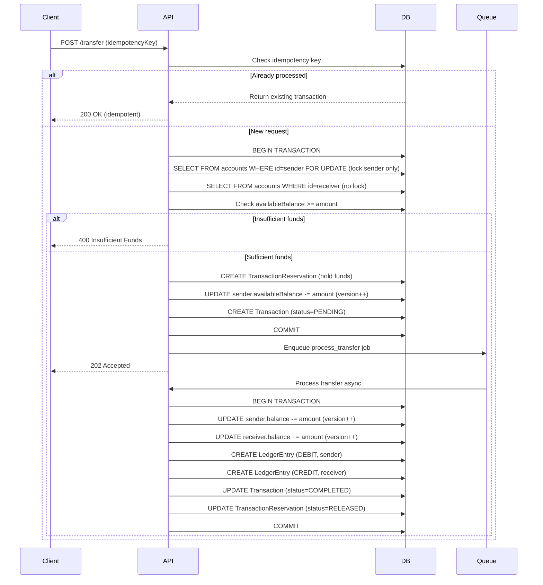
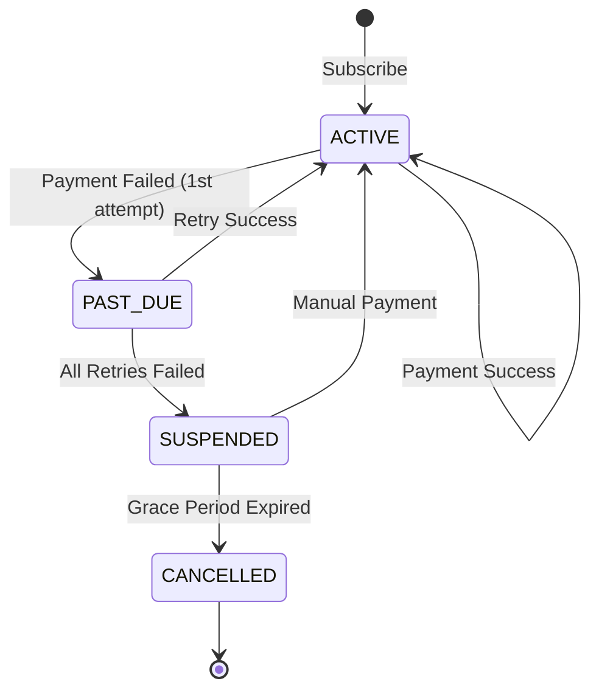
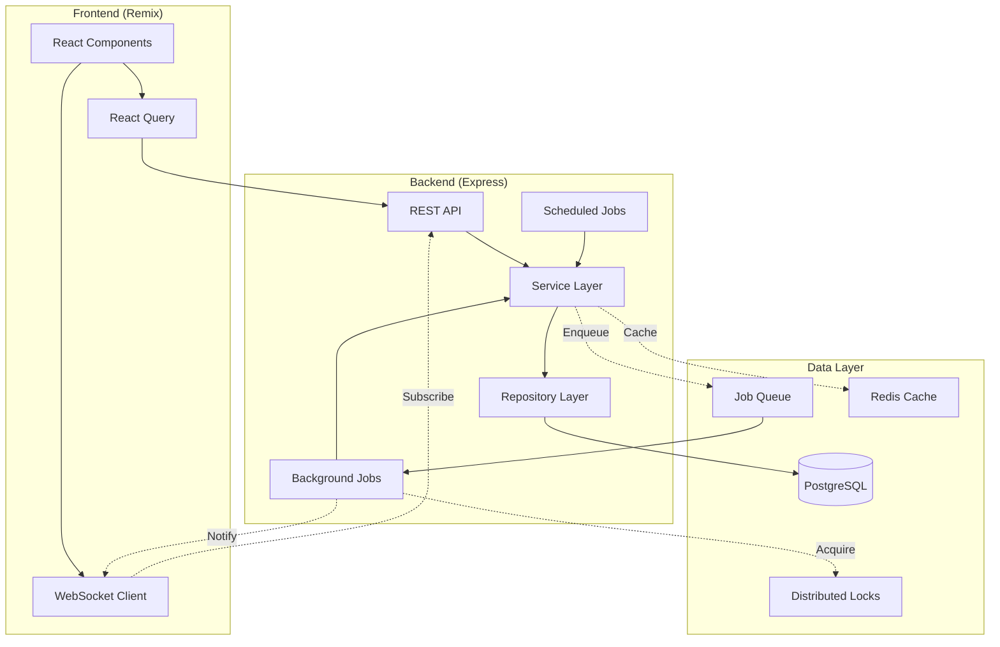

# Recommended Modules for Full-Stack Fintech Development

This document outlines **4 comprehensive modules** that demonstrate end-to-end fintech application development, including backend APIs, frontend integration, system design, and testing strategies.

## Overview

All modules are selected based on the following criteria:

- ✅ **Solve critical fintech problems** (race conditions, idempotency, data integrity)
- ✅ **Demonstrate full-stack capabilities** (BE + FE + Testing)
- ✅ **Show system design expertise** (locking mechanisms, distributed systems)
- ✅ **Provide visual, interactive web experiences**

---

## Module 1: Transfer & Transaction Management 💸

### Summary

This module handles peer-to-peer (P2P) money transfers, transaction processing, and financial statement generation. It addresses critical fintech challenges including race conditions, double-spending prevention, and audit trail maintenance.

### Database Models

- **Transaction**: Core transaction records with idempotency support
- **TransactionReservation**: Two-phase commit for fund holds
- **LedgerEntry**: Double-entry bookkeeping for audit trails
- **Account**: Source and destination accounts with optimistic locking

### Major APIs

#### 1. Create P2P Transfer

**Endpoint**: `POST /api/transactions/transfer`

**Request Body**:

```json
{
  "idempotencyKey": "uuid-v4",
  "fromAccountId": "uuid",
  "toAccountId": "uuid",
  "amount": 100.0,
  "currency": "USD",
  "description": "Payment for services"
}
```

**Problem to Solve: Race Conditions & Concurrent Transactions**

> [!IMPORTANT]
> **The Challenge**: Multiple simultaneous transfers from the same account can cause:
>
> - **Overdraft**: Spending more than available balance
> - **Double-spending**: Same funds transferred multiple times
> - **Inconsistent state**: Balance mismatch between Account and LedgerEntry
> - **Lost updates**: Concurrent writes overwriting each other

**System Design Solutions**:

| Solution                  | Implementation                                           | Purpose                                     |
| ------------------------- | -------------------------------------------------------- | ------------------------------------------- |
| **Pessimistic Locking**   | `SELECT FOR UPDATE` on sender account only               | Prevent overdraft at source                 |
| **Optimistic Locking**    | `version` field for receiver account                     | Handle concurrent deposits safely           |
| **Two-Phase Commit**      | TransactionReservation with PENDING → ACTIVE → COMPLETED | Hold funds before final commit              |
| **Idempotency**           | Unique `idempotencyKey` per transaction                  | Prevent duplicate processing on retry       |
| **Double-Entry Ledger**   | LedgerEntry (DEBIT + CREDIT)                             | Immutable audit trail, balance verification |
| **Database Transactions** | Prisma `.$transaction()` with isolation level            | ACID guarantees across multiple operations  |

**Flow Diagram**:



**Response**:

```json
{
  "id": "uuid",
  "referenceNumber": "TXN20250126-001234",
  "status": "PENDING",
  "amount": 100.0,
  "currency": "USD",
  "createdAt": "2025-01-26T10:33:29Z"
}
```

---

#### 2. Get Transaction History with Statement

**Endpoint**: `GET /api/transactions/history?accountId={id}&limit=50&cursor={cursor}`

**Problem to Solve: Performance & Data Consistency**

> [!WARNING]
> **The Challenge**:
>
> - Query large datasets efficiently (millions of transactions)
> - Generate account statements with running balances
> - Ensure ledger entries sum to current account balance
> - Handle pagination without missing/duplicate records

**System Design Solutions**:

| Solution                    | Implementation                                  | Purpose                                  |
| --------------------------- | ----------------------------------------------- | ---------------------------------------- |
| **Cursor-based Pagination** | Use `createdAt` + `id` as cursor                | Consistent results even with new inserts |
| **Database Indexing**       | Composite index on `(accountId, createdAt, id)` | Fast query performance                   |
| **Balance Verification**    | Sum LedgerEntry amounts vs Account.balance      | Detect inconsistencies                   |
| **Query Optimization**      | Select only needed fields, use `include` wisely | Reduce data transfer                     |
| **Caching**                 | Cache recent transactions with Redis/LRU        | Reduce DB load for common queries        |

**Response**:

```json
{
  "data": [
    {
      "id": "uuid",
      "referenceNumber": "TXN20250126-001234",
      "type": "TRANSFER",
      "amount": -100.0,
      "currency": "USD",
      "balanceAfter": 900.0,
      "description": "Payment for services",
      "createdAt": "2025-01-26T10:33:29Z",
      "counterparty": {
        "accountNumber": "ACC123456",
        "name": "John Doe"
      }
    }
  ],
  "pagination": {
    "nextCursor": "2025-01-26T10:33:29Z|uuid",
    "hasMore": true
  },
  "summary": {
    "currentBalance": 900.0,
    "availableBalance": 850.0,
    "pendingTransactions": 1,
    "totalHolds": 50.0
  }
}
```

---

### Web Integration

#### Dashboard Components

1. **Balance Overview Card**
   - Display settled balance vs available balance
   - Visualize active holds with tooltip
   - Real-time updates via WebSocket

2. **Transfer Form**
   - Autocomplete recipient search
   - Amount validation against available balance
   - Confirmation dialog with summary
   - Optimistic UI updates

3. **Transaction Feed**
   - Infinite scroll with virtualization
   - Filter by type, date range, amount
   - Search by reference number or description
   - Export to PDF/CSV

4. **Statement View**
   - Monthly/quarterly statement generation
   - Running balance column
   - Downloadable PDF with branding

#### Tech Stack (Frontend)

- **Framework**: React 19 with Remix
- **UI Components**: Radix UI primitives + custom design system
- **State Management**: React Query for server state, Zustand for client state
- **Real-time**: WebSocket with automatic reconnection
- **Forms**: React Hook Form + Zod validation
- **Charts**: Recharts for balance timeline visualization

---

### Full Development Flow

#### Phase 1: Backend (BE)

1. **API Design** (1 day)
   - Define OpenAPI 3.1 specification
   - Document request/response schemas
   - Define error codes and messages

2. **Repository Pattern** (2 days)
   - Create `ITransactionRepository` interface
   - Implement with Prisma queries
   - Add optimistic locking with retry logic
   - Write unit tests for repository methods

3. **Service Layer** (3 days)
   - Implement `TransactionService` with business logic
   - Add two-phase commit flow
   - Implement idempotency checks
   - Create background job for async processing
   - Write unit tests with mocked repositories

4. **Controller & Routes** (1 day)
   - Implement HTTP handlers
   - Add Zod validation middleware
   - Map entities to DTOs
   - Add error handling middleware

5. **Background Jobs** (1 day)
   - Set up BullMQ or similar job queue
   - Implement transfer processing job
   - Add retry logic with exponential backoff
   - Monitor job failures

#### Phase 2: Frontend (FE)

1. **API Client** (1 day)
   - Generate TypeScript types from OpenAPI spec
   - Create API client with fetch wrapper
   - Add interceptors for auth/error handling

2. **Transfer Flow** (3 days)
   - Build transfer form with validation
   - Implement recipient search with debouncing
   - Add confirmation modal
   - Handle success/error states
   - Add optimistic updates

3. **Transaction List** (2 days)
   - Build infinite scroll component
   - Add filters and search
   - Implement virtual scrolling for performance
   - Add loading skeletons

4. **Real-time Updates** (2 days)
   - Set up WebSocket connection
   - Subscribe to account-specific events
   - Update UI on transaction status changes
   - Handle reconnection gracefully

#### Phase 3: Testing

1. **Unit Tests** (ongoing)
   - Test repository methods with in-memory DB
   - Test service logic with mocked dependencies
   - Test React components with React Testing Library
   - Achieve >80% code coverage

2. **Integration Tests** (2 days)
   - Test API endpoints with Supertest
   - Test database transactions with test DB
   - Test WebSocket events

3. **E2E Tests** (2 days)
   - Use Playwright for browser automation
   - Test complete transfer flow
   - Test error scenarios (insufficient funds, network errors)
   - Test concurrent transfers

4. **Load Testing** (1 day)
   - Use k6 or Artillery
   - Simulate 100+ concurrent transfers
   - Measure API latency (p50, p95, p99)
   - Identify bottlenecks

---

## Module 2: Account Management ~~with Balance Holds~~ 🏦

> [!NOTE]
> **Update**: The "Balance Holds" API has been removed from this module as it's redundant with Module 1's `TransactionReservation` mechanism. This module now focuses on core account management features.

### Summary

This module handles account creation, balance management, and customer onboarding. It demonstrates data integrity, business rule enforcement, and proper account lifecycle management.

### Database Models

- **Account**: Core account entity with balance tracking
- **Customer**: Account owner with KYC status
- **TransactionReservation**: Referenced from Module 1 for holds

### Major APIs

#### 1. Create Account with KYC Validation

**Endpoint**: `POST /api/accounts`

**Request Body**:

```json
{
  "customerId": "uuid",
  "currency": "USD",
  "initialDeposit": 100.0
}
```

**Problem to Solve: Data Integrity & Business Rules**

> [!IMPORTANT]
> **The Challenge**:
>
> - Ensure unique account numbers (prevent collisions)
> - Validate customer KYC status before account creation
> - Handle multi-currency accounts correctly
> - Set proper initial states and balances
> - Maintain referential integrity across modules

**System Design Solutions**:

| Solution                    | Implementation                                   | Purpose                                      |
| --------------------------- | ------------------------------------------------ | -------------------------------------------- |
| **Database Constraints**    | `@unique` on `accountNumber`                     | Enforce uniqueness at DB level               |
| **Custom Generator**        | IBAN-like algorithm with check digits            | Generate collision-resistant account numbers |
| **Cross-module Validation** | Check Customer.kycStatus before creation         | Enforce business rules                       |
| **Atomic Operations**       | Prisma transaction for account + initial deposit | All-or-nothing consistency                   |
| **Idempotency**             | Return existing account if duplicate request     | Handle network retries safely                |

**Account Number Generation Algorithm**:

```typescript
// Format: CCBBBBBBBBBBCCCC
// CC: Country code (2 digits)
// BBBBBBBBBB: Sequential base-36 number (10 chars)
// CCCC: Check digits using Luhn algorithm

function generateAccountNumber(countryCode: string = 'US'): string {
  const timestamp = Date.now();
  const random = Math.floor(Math.random() * 1000000);
  const base = (timestamp * 1000000 + random).toString(36).toUpperCase();
  const baseNumber = base.padStart(10, '0').slice(-10);
  const checkDigit = calculateLuhn(countryCode + baseNumber);

  return `${countryCode}${baseNumber}${checkDigit}`;
}
```

**Response**:

```json
{
  "id": "uuid",
  "accountNumber": "US1A2B3C4D561234",
  "currency": "USD",
  "balance": 100.0,
  "availableBalance": 100.0,
  "status": "ACTIVE",
  "createdAt": "2025-01-26T10:33:29Z"
}
```

---

#### 2. Get Account Balance & Summary

**Endpoint**: `GET /api/accounts/:id/balance`

**Response**:

```json
{
  "accountId": "uuid",
  "accountNumber": "US1A2B3C4D561234",
  "balance": 1000.0,
  "availableBalance": 850.0,
  "currency": "USD",
  "activeHolds": 150.0,
  "pendingTransactions": 2,
  "lastUpdated": "2025-11-28T10:00:00Z"
}
```

---

### Web Integration

#### Dashboard Components

1. **Account Creation Wizard**
   - Multi-step form (Customer info → Currency → Initial deposit)
   - Real-time validation with Zod
   - Progress indicator
   - Success animation with generated account number

2. **Account Overview Dashboard**
   - Card showing balance breakdown:
     - Settled balance (large, bold)
     - Available balance (highlighted)
     - Total holds (with popover showing details)
   - Mini chart: 30-day balance trend
   - Quick actions: Transfer, Add funds, View statement

3. **Account Details Page**
   - Full account information
   - Transaction history integration
   - Account settings and preferences
   - Export account statement

---

### Full Development Flow

#### Phase 1: Backend (BE)

1. **Account Number Generator** (0.5 day)
   - Implement generation algorithm
   - Add unit tests for uniqueness
   - Add database constraint validation

2. **Repository Layer** (1.5 days)
   - Create `IAccountRepository` interface
   - Implement CRUD operations with Prisma
   - Add balance query methods
   - Write unit tests

3. **Service Layer** (2 days)
   - Implement `AccountService` with business logic
   - Add KYC validation by calling `CustomerService`
   - Implement balance calculation logic
   - Add initial deposit handling
   - Write unit tests

4. **Controller & Routes** (1 day)
   - Implement HTTP handlers
   - Add validation middleware
   - Add error handling

#### Phase 2: Frontend (FE)

1. **Account Creation Flow** (2 days)
   - Build multi-step wizard component
   - Implement form validation
   - Add success state with animation
   - Handle errors gracefully

2. **Account Dashboard** (3 days)
   - Build balance overview cards
   - Implement balance timeline chart with Recharts
   - Add responsive design for mobile
   - Add loading states and skeletons

3. **Real-time Balance Updates** (1 day)
   - Subscribe to WebSocket for balance changes
   - Update UI when transactions complete
   - Add smooth animations for balance changes

#### Phase 3: Testing

1. **Unit Tests** (ongoing)
   - Test account number generator (collision resistance)
   - Test balance calculations
   - Test KYC validation logic
   - Test React components

2. **Integration Tests** (1.5 days)
   - Test account creation with invalid customer
   - Test initial deposit handling
   - Test balance queries

3. **E2E Tests** (1.5 days)
   - Test complete account creation flow
   - Test account dashboard rendering
   - Test error scenarios

---

## Module 3: Recurring Payments & Scheduled Transactions 🔄

### Summary

This module handles subscription billing, scheduled transfers, loan repayments, and any recurring payment scenarios. It demonstrates distributed job scheduling, retry logic, state machines, and failure handling patterns that power most fintech revenue streams.

### Why Critical?

- **Every fintech app needs this**: Subscriptions, loan repayments, salary disbursements, auto-pay bills
- **Teaches**: Job scheduling, retry logic, state machines, failure handling, idempotency at scale
- **Real-world impact**: Powers 60%+ of fintech revenue (subscriptions, SaaS payments)
- **Interview gold**: Extremely common system design question

### Database Models

```prisma
model ScheduledPayment {
  id            String   @id @default(uuid())
  customerId    String
  accountId     String   // Source account

  // Recurrence Pattern
  frequency     String   // DAILY, WEEKLY, MONTHLY, YEARLY
  amount        BigInt
  currency      String

  // Scheduling
  startDate     DateTime
  nextRunAt     DateTime  // Next execution time
  lastRunAt     DateTime? // Last successful run
  endDate       DateTime? // Optional end date

  // State
  status        String   // ACTIVE, PAUSED, CANCELLED, SUSPENDED
  failureCount  Int      @default(0)
  lastFailureReason String?

  // Metadata
  description   String?
  metadata      Json     @default("{}")

  createdAt     DateTime @default(now())
  updatedAt     DateTime @updatedAt

  customer      Customer @relation(...)
  account       Account  @relation(...)
  executions    PaymentExecution[]

  @@index([nextRunAt, status])  // Critical for job processing
  @@index([accountId])
}

model PaymentExecution {
  id                  String   @id @default(uuid())
  scheduledPaymentId  String
  transactionId       String?  // Links to actual transaction if successful

  executionDate       DateTime // When it was supposed to run
  executedAt          DateTime @default(now())

  status              String   // SUCCESS, FAILED, RETRYING
  failureReason       String?
  attemptNumber       Int      // 1st, 2nd, 3rd retry

  scheduledPayment    ScheduledPayment @relation(...)
  transaction         Transaction?     @relation(...)

  @@unique([scheduledPaymentId, executionDate])  // Prevent duplicate runs
  @@index([executedAt])
}
```

### Problems to Solve

#### 1. **Distributed Cron & Job Scheduling**

> **Challenge**: How do you ensure a payment runs **exactly once** even with multiple backend servers?

**Problems**:

- Multiple instances of your app running
- Server crashes mid-execution
- Clock skew between servers

**Solutions**:

| Solution                | Implementation                                 | Purpose                              |
| ----------------------- | ---------------------------------------------- | ------------------------------------ |
| **Distributed Lock**    | Redis lock with TTL or Postgres advisory locks | Only one instance processes each job |
| **Job Queue**           | BullMQ with unique job IDs                     | Guaranteed execution, auto-retry     |
| **Idempotency Key**     | Use `scheduleId + executionDate` as key        | Prevent duplicate charges            |
| **Job Status Tracking** | `ScheduledPayment.lastRunAt`, `nextRunAt`      | Track execution history              |

---

#### 2. **Smart Retry Logic with Exponential Backoff**

> **Challenge**: What happens when a recurring payment fails? When do you give up?

**Problems**:

- Insufficient funds (temporary vs permanent failure)
- Network errors vs business logic errors
- How many retries before canceling subscription?

**Solutions**:

| Solution                   | Implementation                                     | Purpose                       |
| -------------------------- | -------------------------------------------------- | ----------------------------- |
| **Retry Strategy**         | 3 attempts: immediate, +1 hour, +24 hours          | Handle temporary failures     |
| **Failure Classification** | Retryable vs Non-retryable errors                  | Different handling strategies |
| **Grace Period**           | Continue service for 3 days during retries         | Better UX                     |
| **Notification System**    | Email on each failure, final warning before cancel | Customer communication        |

---

#### 3. **Subscription State Machine**

> **Challenge**: How do you manage complex subscription lifecycles?

**States**: `ACTIVE → PAST_DUE → SUSPENDED → CANCELLED` or `ACTIVE → RENEWED`

**Flow**:



---

### Major APIs

#### 1. Create Recurring Payment

**Endpoint**: `POST /api/scheduled-payments`

**Request Body**:

```json
{
  "accountId": "uuid",
  "amount": 999,
  "currency": "USD",
  "frequency": "MONTHLY",
  "startDate": "2025-12-01T00:00:00Z",
  "description": "Netflix Premium Subscription",
  "metadata": {
    "planId": "premium",
    "merchantId": "NETFLIX"
  }
}
```

**Response**:

```json
{
  "id": "sched-123",
  "status": "ACTIVE",
  "nextRunAt": "2025-12-01T00:00:00Z",
  "createdAt": "2025-11-28T10:00:00Z"
}
```

---

#### 2. Process Scheduled Payments (Background Job)

**Implementation**:

```typescript
// Runs every minute via cron or BullMQ
async function processScheduledPayments() {
  const duePayments = await prisma.scheduledPayment.findMany({
    where: {
      nextRunAt: { lte: new Date() },
      status: 'ACTIVE',
    },
    take: 100, // Batch processing
  });

  for (const payment of duePayments) {
    // Acquire distributed lock
    const lock = await acquireLock(`payment:${payment.id}`);
    if (!lock) continue; // Another instance is processing

    try {
      await executePayment(payment);
    } finally {
      await lock.release();
    }
  }
}

async function executePayment(payment: ScheduledPayment) {
  const idempotencyKey = `${payment.id}-${payment.nextRunAt.toISOString()}`;

  try {
    // Execute transfer using Module 1 API
    const transaction = await transferService.transfer({
      fromAccountId: payment.accountId,
      amount: payment.amount,
      idempotencyKey,
      description: payment.description,
    });

    // Record success
    await prisma.paymentExecution.create({
      data: {
        scheduledPaymentId: payment.id,
        transactionId: transaction.id,
        executionDate: payment.nextRunAt,
        status: 'SUCCESS',
        attemptNumber: 1,
      },
    });

    // Schedule next run
    await prisma.scheduledPayment.update({
      where: { id: payment.id },
      data: {
        nextRunAt: calculateNextRun(payment),
        lastRunAt: new Date(),
        failureCount: 0,
      },
    });
  } catch (error) {
    await handleFailure(payment, error);
  }
}

async function handleFailure(payment: ScheduledPayment, error: Error) {
  const isRetryable = classifyError(error); // Network error vs NSF

  if (!isRetryable || payment.failureCount >= 3) {
    // Suspend subscription
    await prisma.scheduledPayment.update({
      where: { id: payment.id },
      data: {
        status: 'SUSPENDED',
        lastFailureReason: error.message,
      },
    });

    // Send notification
    await notificationService.sendPaymentFailure(payment);
  } else {
    // Schedule retry with exponential backoff
    const retryDelays = [3600, 86400]; // 1 hour, 24 hours
    const delay = retryDelays[payment.failureCount] || 0;

    await prisma.scheduledPayment.update({
      where: { id: payment.id },
      data: {
        nextRunAt: new Date(Date.now() + delay * 1000),
        failureCount: { increment: 1 },
        lastFailureReason: error.message,
      },
    });
  }

  // Log execution attempt
  await prisma.paymentExecution.create({
    data: {
      scheduledPaymentId: payment.id,
      executionDate: payment.nextRunAt,
      status: 'FAILED',
      failureReason: error.message,
      attemptNumber: payment.failureCount + 1,
    },
  });
}

function calculateNextRun(payment: ScheduledPayment): Date {
  const current = payment.nextRunAt;

  switch (payment.frequency) {
    case 'DAILY':
      return new Date(current.getTime() + 86400000); // +1 day
    case 'WEEKLY':
      return new Date(current.getTime() + 604800000); // +7 days
    case 'MONTHLY':
      const next = new Date(current);
      next.setMonth(next.getMonth() + 1);
      return next;
    case 'YEARLY':
      const nextYear = new Date(current);
      nextYear.setFullYear(nextYear.getFullYear() + 1);
      return nextYear;
    default:
      throw new Error(`Unknown frequency: ${payment.frequency}`);
  }
}

function classifyError(error: Error): boolean {
  // Retryable errors
  if (
    error.message.includes('Network') ||
    error.message.includes('timeout') ||
    error.message.includes('unavailable')
  ) {
    return true;
  }

  // Non-retryable errors
  if (
    error.message.includes('Insufficient funds') ||
    error.message.includes('Account closed') ||
    error.message.includes('Invalid account')
  ) {
    return false;
  }

  return false; // Default: don't retry unknown errors
}
```

---

#### 3. Additional APIs

```typescript
GET    /api/scheduled-payments/:id              // Get details
PATCH  /api/scheduled-payments/:id              // Update amount/frequency
POST   /api/scheduled-payments/:id/pause        // Pause subscription
POST   /api/scheduled-payments/:id/resume       // Resume subscription
DELETE /api/scheduled-payments/:id              // Cancel subscription
GET    /api/scheduled-payments/:id/executions   // Execution history
GET    /api/scheduled-payments                  // List all for customer
```

---

### Web Integration

#### Dashboard Components

1. **Subscription Management Page**
   - List all active subscriptions
   - Show next payment date and amount
   - Pause/Resume/Cancel actions
   - Edit subscription details

2. **Subscription Creation Wizard**
   - Select frequency (Daily/Weekly/Monthly/Yearly)
   - Set amount and start date
   - Preview upcoming charges
   - Confirm and activate

3. **Payment History Timeline**
   - Visual timeline of all executions
   - Success/Failed status indicators
   - Retry attempts shown
   - Failure reasons displayed

4. **Subscription Details Modal**
   - Full execution history
   - Upcoming payment schedule
   - Edit frequency or amount
   - Download payment receipts

---

### Full Development Flow

#### Phase 1: Backend (BE)

1. **Database Schema** (0.5 day)
   - Add ScheduledPayment and PaymentExecution models
   - Run migrations
   - Add indexes for performance

2. **Repository Layer** (1 day)
   - Create `IScheduledPaymentRepository`
   - Implement CRUD operations
   - Add query methods for due payments
   - Write unit tests

3. **Service Layer** (2 days)
   - Implement `ScheduledPaymentService`
   - Add payment execution logic
   - Implement retry strategy
   - Add failure classification
   - Write unit tests

4. **Background Job Setup** (1.5 days)
   - Set up BullMQ or cron
   - Implement distributed locking (Redis)
   - Add job monitoring
   - Test concurrent execution

5. **Controller & Routes** (1 day)
   - Implement all REST endpoints
   - Add validation middleware
   - Add error handling

#### Phase 2: Frontend (FE)

1. **Subscription List** (2 days)
   - Build subscription cards
   - Add filters (active/paused/cancelled)
   - Implement pause/resume actions
   - Add loading states

2. **Create Subscription Flow** (2 days)
   - Build multi-step form
   - Add frequency selector
   - Show payment preview
   - Handle success/error states

3. **Execution History** (1.5 days)
   - Build timeline component
   - Show success/failure states
   - Add retry information
   - Implement pagination

#### Phase 3: Testing

1. **Unit Tests** (ongoing)
   - Test date calculation logic
   - Test retry strategy
   - Test error classification
   - Test state transitions

2. **Integration Tests** (2 days)
   - Test job execution
   - Test distributed locking
   - Test retry flow
   - Test with mocked time

3. **E2E Tests** (1.5 days)
   - Test subscription creation
   - Test payment execution
   - Test failure scenarios
   - Test pause/resume

---

### Learning Outcomes

✅ **Distributed systems patterns** (locking, job queues)
✅ **State machines** for complex workflows
✅ **Error classification and retry strategies**
✅ **Idempotency at scale** (same payment run twice = no duplicate)
✅ **Time-based job scheduling**
✅ **Background job monitoring and alerting**

---

## Module 4: Daily Balance Reconciliation & Ledger Verification 🔍

### Summary

This module implements daily reconciliation processes to ensure data integrity across accounts and ledgers. It demonstrates batch processing, database aggregations, discrepancy detection, and compliance reporting - critical for any production fintech system.

### Why Critical?

- **Regulatory requirement**: Banks must reconcile daily
- **Data integrity**: Catch bugs before money is lost
- **Teaches**: Batch processing, database aggregations, discrepancy detection, audit trails
- **Interview gold**: Shows you understand financial accuracy matters
- **Production-readiness**: Separates toy projects from real systems

### Database Models

```prisma
model ReconciliationReport {
  id                 String   @id @default(uuid())
  reportDate         DateTime @db.Date

  totalAccounts      Int
  accountsChecked    Int
  discrepanciesFound Int

  totalTransactions  Int
  transactionVolume  BigInt

  status             String   // PASS, FAIL, NEEDS_REVIEW
  discrepancies      Json     @default("[]")

  createdAt          DateTime @default(now())

  @@unique([reportDate])
  @@index([reportDate])
}

model ReconciliationTask {
  id          String   @id @default(uuid())
  accountId   String

  issueType   String   // BALANCE_MISMATCH, ORPHANED_RESERVATION, etc.
  expectedValue BigInt
  actualValue   BigInt
  difference    BigInt

  status      String   @default("PENDING")  // PENDING, RESOLVED, ESCALATED
  resolution  String?

  detectedAt  DateTime @default(now())
  resolvedAt  DateTime?

  account     Account  @relation(...)

  @@index([accountId, status])
  @@index([detectedAt])
}
```

### Problems to Solve

#### 1. **Balance vs Ledger Mismatch Detection**

> **Challenge**: How do you ensure `Account.balance` matches `SUM(LedgerEntry)` for that account?

**Problems**:

- Concurrent transactions might update balance but fail to create ledger entry
- Database transaction rollback might leave orphaned records
- Bugs in code logic

**Solution**:

```typescript
// Run daily at 2 AM
async function reconcileAllAccounts() {
  const accounts = await prisma.account.findMany();
  const discrepancies = [];

  for (const account of accounts) {
    const ledgerSum = await prisma.ledgerEntry.aggregate({
      where: { accountId: account.id },
      _sum: { amount: true }, // Sum of all DEBIT - CREDIT
    });

    const calculatedBalance = ledgerSum._sum.amount || 0n;

    if (calculatedBalance !== account.balance) {
      discrepancies.push({
        accountId: account.id,
        accountBalance: account.balance,
        ledgerBalance: calculatedBalance,
        difference: account.balance - calculatedBalance,
        detectedAt: new Date(),
      });

      // Auto-fix or alert for manual review
      await createReconciliationTask(account, calculatedBalance);
    }
  }

  // Store results
  await prisma.reconciliationReport.create({
    data: {
      reportDate: new Date(),
      totalAccounts: accounts.length,
      discrepanciesFound: discrepancies.length,
      discrepancies: discrepancies,
    },
  });

  return discrepancies;
}
```

---

#### 2. **Transaction Integrity Checks**

> **Challenge**: Detect orphaned reservations, stuck pending transactions, missing ledger entries

**Checks**:

| Check                          | Query                                                                | Action                       |
| ------------------------------ | -------------------------------------------------------------------- | ---------------------------- |
| **Stuck Pending Transactions** | `WHERE status = 'PENDING' AND createdAt < NOW() - INTERVAL '1 hour'` | Alert operations team        |
| **Orphaned Reservations**      | `WHERE status = 'ACTIVE' AND expiresAt < NOW()`                      | Auto-release                 |
| **Missing Ledger Pairs**       | Transactions with only DEBIT or only CREDIT entry                    | Create missing entry or flag |
| **Balance Drift**              | `availableBalance > balance` (impossible state)                      | Fix or escalate              |

**Implementation**:

```typescript
async function runIntegrityChecks() {
  const issues = [];

  // Check 1: Stuck pending transactions
  const stuckTransactions = await prisma.transaction.findMany({
    where: {
      status: 'PENDING',
      createdAt: { lt: new Date(Date.now() - 3600000) }, // 1 hour ago
    },
  });

  for (const tx of stuckTransactions) {
    issues.push({
      type: 'STUCK_PENDING_TRANSACTION',
      transactionId: tx.id,
      createdAt: tx.createdAt,
    });
  }

  // Check 2: Orphaned reservations (expired but still active)
  const orphanedReservations = await prisma.transactionReservation.findMany({
    where: {
      status: 'ACTIVE',
      expiresAt: { lt: new Date() },
    },
  });

  // Auto-fix: Release them
  for (const reservation of orphanedReservations) {
    await prisma.transactionReservation.update({
      where: { id: reservation.id },
      data: { status: 'RELEASED' },
    });

    await prisma.account.update({
      where: { id: reservation.accountId },
      data: {
        availableBalance: { increment: reservation.amount },
      },
    });
  }

  // Check 3: Missing ledger pairs
  const transactions = await prisma.transaction.findMany({
    where: { status: 'COMPLETED' },
    include: { ledgerEntries: true },
  });

  for (const tx of transactions) {
    const debits = tx.ledgerEntries.filter((e) => e.entryType === 'DEBIT');
    const credits = tx.ledgerEntries.filter((e) => e.entryType === 'CREDIT');

    if (debits.length !== credits.length) {
      issues.push({
        type: 'MISSING_LEDGER_PAIR',
        transactionId: tx.id,
        debits: debits.length,
        credits: credits.length,
      });
    }
  }

  // Check 4: Balance drift
  const driftAccounts = await prisma.account.findMany({
    where: {
      availableBalance: { gt: prisma.raw('balance') },
    },
  });

  for (const account of driftAccounts) {
    issues.push({
      type: 'BALANCE_DRIFT',
      accountId: account.id,
      balance: account.balance,
      availableBalance: account.availableBalance,
    });
  }

  return issues;
}
```

---

#### 3. **End-of-Day Settlement Report**

> **Challenge**: Generate daily financial report for compliance

**Metrics**:

```typescript
{
  "reportDate": "2025-11-28",
  "totalTransactionVolume": 1500000,  // $15,000 total moved
  "transactionCount": 347,
  "successfulTransactions": 342,
  "failedTransactions": 5,
  "totalFees": 2500,  // $25 in fees collected
  "activeAccounts": 128,
  "newAccountsToday": 3,
  "reconciliationStatus": "PASS",
  "discrepanciesFound": 0
}
```

**Implementation**:

```typescript
async function generateDailyReport(date: Date) {
  const startOfDay = new Date(date.setHours(0, 0, 0, 0));
  const endOfDay = new Date(date.setHours(23, 59, 59, 999));

  // Transaction metrics
  const transactions = await prisma.transaction.findMany({
    where: {
      createdAt: { gte: startOfDay, lte: endOfDay },
    },
  });

  const successful = transactions.filter((t) => t.status === 'COMPLETED');
  const failed = transactions.filter((t) => t.status === 'FAILED');

  const totalVolume = successful.reduce((sum, t) => sum + Number(t.amount), 0);

  // Account metrics
  const totalAccounts = await prisma.account.count();
  const newAccounts = await prisma.account.count({
    where: {
      createdAt: { gte: startOfDay, lte: endOfDay },
    },
  });

  // Run reconciliation
  const reconciliation = await reconcileAllAccounts();

  // Generate report
  const report = {
    reportDate: date.toISOString().split('T')[0],
    totalTransactionVolume: totalVolume,
    transactionCount: transactions.length,
    successfulTransactions: successful.length,
    failedTransactions: failed.length,
    activeAccounts: totalAccounts,
    newAccountsToday: newAccounts,
    reconciliationStatus: reconciliation.length === 0 ? 'PASS' : 'FAIL',
    discrepanciesFound: reconciliation.length,
  };

  return report;
}
```

---

### Major APIs

#### 1. Trigger Manual Reconciliation

**Endpoint**: `POST /api/reconciliation/run`

**Response**:

```json
{
  "reportId": "rec-123",
  "status": "PROCESSING",
  "estimatedCompletion": "2025-11-28T02:15:00Z"
}
```

---

#### 2. Get Reconciliation Report

**Endpoint**: `GET /api/reconciliation/reports?date=2025-11-28`

**Response**:

```json
{
  "reportDate": "2025-11-28",
  "status": "PASS",
  "totalAccounts": 1250,
  "accountsChecked": 1250,
  "discrepanciesFound": 0,
  "totalTransactions": 347,
  "transactionVolume": 1500000,
  "createdAt": "2025-11-28T02:00:00Z",
  "downloadUrl": "/api/reconciliation/reports/rec-123/pdf"
}
```

---

#### 3. Get Discrepancies for Review

**Endpoint**: `GET /api/reconciliation/tasks?status=PENDING`

**Response**:

```json
{
  "tasks": [
    {
      "id": "task-1",
      "accountId": "acc-123",
      "accountNumber": "US1A2B3C4D561234",
      "issueType": "BALANCE_MISMATCH",
      "expectedValue": 100000,
      "actualValue": 100100,
      "difference": 100,
      "detectedAt": "2025-11-28T02:00:00Z",
      "status": "PENDING"
    }
  ]
}
```

---

#### 4. Resolve Reconciliation Task

**Endpoint**: `POST /api/reconciliation/tasks/:id/resolve`

**Request Body**:

```json
{
  "resolution": "Fixed by adjusting ledger entry - user refund was not recorded",
  "action": "AUTO_FIX"
}
```

---

### Background Job Implementation

```typescript
// Schedule: Every day at 2 AM
cron.schedule('0 2 * * *', async () => {
  console.log('Starting daily reconciliation...');

  // Run all checks
  const balanceReconciliation = await reconcileAllAccounts();
  const integrityIssues = await runIntegrityChecks();
  const dailyReport = await generateDailyReport(new Date());

  // Alert if issues found
  if (balanceReconciliation.length > 0 || integrityIssues.length > 0) {
    await alertService.sendCritical({
      subject: `[URGENT] Reconciliation Issues Found`,
      balanceDiscrepancies: balanceReconciliation.length,
      integrityIssues: integrityIssues.length,
      details: { balanceReconciliation, integrityIssues },
    });
  }

  // Generate PDF report for compliance
  await generateComplianceReport(dailyReport);

  console.log('Daily reconciliation completed');
});
```

---

### Web Integration

#### Dashboard Components

1. **Reconciliation Dashboard**
   - Daily reconciliation status (PASS/FAIL)
   - Number of discrepancies found
   - Link to view details
   - Trigger manual reconciliation

2. **Discrepancy Review Panel**
   - List of all pending tasks
   - Filter by issue type
   - Quick actions: Auto-fix, Escalate, Mark resolved
   - Add resolution notes

3. **Compliance Reports**
   - Calendar view of daily reports
   - Download PDF/CSV
   - Visualize trends (discrepancies over time)
   - Export for auditors

---

### Full Development Flow

#### Phase 1: Backend (BE)

1. **Database Schema** (0.5 day)
   - Add ReconciliationReport and ReconciliationTask models
   - Run migrations
   - Add indexes

2. **Repository Layer** (1 day)
   - Create `IReconciliationRepository`
   - Implement aggregation queries
   - Add batch processing methods
   - Write unit tests

3. **Service Layer** (2 days)
   - Implement reconciliation logic
   - Add integrity check functions
   - Implement auto-fix strategies
   - Add alerting integration
   - Write unit tests

4. **Background Job Setup** (1 day)
   - Set up daily cron job
   - Add job monitoring
   - Test with large datasets

5. **Controller & Routes** (1 day)
   - Implement all endpoints
   - Add validation
   - Add error handling

#### Phase 2: Frontend (FE)

1. **Reconciliation Dashboard** (2 days)
   - Build status overview
   - Add trigger manual run button
   - Show recent reports
   - Add loading states

2. **Discrepancy Review** (2 days)
   - Build task list table
   - Add filters and sorting
   - Implement resolve actions
   - Add resolution notes

3. **Report Viewer** (1.5 days)
   - Build report details page
   - Add PDF download
   - Show historical trends
   - Add export options

#### Phase 3: Testing

1. **Unit Tests** (ongoing)
   - Test aggregation logic
   - Test discrepancy detection
   - Test auto-fix strategies
   - Test edge cases

2. **Integration Tests** (2 days)
   - Test with seeded data
   - Test job execution
   - Test alert triggering
   - Test with large datasets

3. **E2E Tests** (1 day)
   - Test manual reconciliation
   - Test discrepancy resolution
   - Test report generation

---

### Learning Outcomes

✅ **Database aggregations at scale** (`SUM`, `COUNT`, `GROUP BY`)
✅ **Data integrity patterns** (detecting and fixing inconsistencies)
✅ **Batch processing** (processing thousands of accounts efficiently)
✅ **Audit trails and compliance reporting**
✅ **Monitoring and alerting** (proactive issue detection)
✅ **Auto-fix vs manual escalation strategies**

---

## Comparison Matrix

| Aspect                | Module 1: Transfers                   | Module 2: Accounts                       | Module 3: Recurring Payments             | Module 4: Reconciliation             |
| --------------------- | ------------------------------------- | ---------------------------------------- | ---------------------------------------- | ------------------------------------ |
| **Primary Challenge** | Race conditions, concurrent writes    | Data integrity, business rules           | Distributed scheduling, retry logic      | Data integrity verification          |
| **Locking Strategy**  | Optimistic locking + two-phase commit | Database constraints + atomic operations | Distributed locks for job processing     | Read-only analysis (no locks needed) |
| **Background Jobs**   | Async transfer processing             | None                                     | Scheduled payment execution              | Daily reconciliation cron            |
| **Complexity**        | High (distributed systems)            | Medium (state management)                | High (distributed systems)               | Medium (batch processing)            |
| **Real-time Updates** | Critical (transaction status)         | Important (balance changes)              | Moderate (execution notifications)       | Low (daily reports)                  |
| **Testing Focus**     | Concurrency, load testing             | Time-based logic, validation             | Job execution, retry logic, time mocking | Aggregation accuracy, edge cases     |
| **Learning Value**    | Advanced (fintech-specific patterns)  | Intermediate (general patterns)          | Advanced (scheduling, state machines)    | Advanced (production-readiness)      |
| **User-facing**       | Yes (customer transfers)              | Yes (account creation)                   | Yes (subscription management)            | No (internal operations)             |
| **Build Time (BE)**   | 5-6 days                              | 3-4 days                                 | 4-5 days                                 | 3-4 days                             |

---

## Combined System Architecture



---

## Development Timeline Estimate

### Module 1: Transfers (Backend: 5-6 days)

- Repository + Service: 3 days
- Controller + Background Jobs: 2-3 days

### Module 2: Accounts (Backend: 3-4 days)

- Account number generator: 0.5 day
- Repository + Service: 2 days
- Controller: 1 day

### Module 3: Recurring Payments (Backend: 4-5 days)

- Repository + Service: 2 days
- Background job + distributed locking: 2 days
- Controller: 1 day

### Module 4: Reconciliation (Backend: 3-4 days)

- Repository + Service: 2 days
- Background job + reporting: 1-2 days
- Controller: 1 day

### Total Backend Development: ~15-19 days

---

## Recommended Build Order

### **Phase 1: Foundation** (8-10 days)

1. ✅ **Module 1: Transfers** - Core functionality with reservations
2. ✅ **Module 2: Accounts** - Foundation for all other modules

### **Phase 2: Advanced Features** (4-5 days)

3. 🔄 **Module 3: Recurring Payments** - Most impressive, teaches distributed systems

### **Phase 3: Production Polish** (3-4 days)

4. 🔍 **Module 4: Reconciliation** - Shows production-readiness and maturity

---

## Success Metrics

### Performance

- API latency: p95 < 200ms
- Concurrent transfers: 100+ req/s without errors
- Database queries: < 50ms for indexed lookups
- Background job processing: < 5s per payment

### Reliability

- Zero double-spending incidents
- 100% idempotency compliance
- Balance reconciliation: 100% match with ledger
- Job execution: 99.9% success rate

### User Experience

- Page load time: < 2s
- Real-time update latency: < 500ms
- Form validation: < 100ms

---

## Next Steps

1. **Choose Module Priority**: Follow recommended build order above
2. **Set Up Development Environment**: Ensure Prisma migrations are up-to-date
3. **Create Implementation Plan**: Detailed task breakdown for current module
4. **API Contract Design**: Define OpenAPI spec before coding
5. **Database Seeding**: Create test data for development

---

## Additional Resources

- [Prisma Schema Reference](file:///Users/messi/Projects/Others/fintech-preparation/apps/backend/prisma/schema)
- [Coding Conventions](file:///Users/messi/Projects/Others/fintech-preparation/docs/CODING-CONVENTIONS.md)
- [Double-Entry Bookkeeping Principles](https://en.wikipedia.org/wiki/Double-entry_bookkeeping)
- [Two-Phase Commit Protocol](https://en.wikipedia.org/wiki/Two-phase_commit_protocol)

---

> [!TIP]
> **Recommendation**: Build in order: **Module 1 (Transfers)** → **Module 2 (Accounts)** → **Module 3 (Recurring Payments)** → **Module 4 (Reconciliation)**. This sequence ensures each module builds upon the previous ones and demonstrates progressively advanced patterns.
